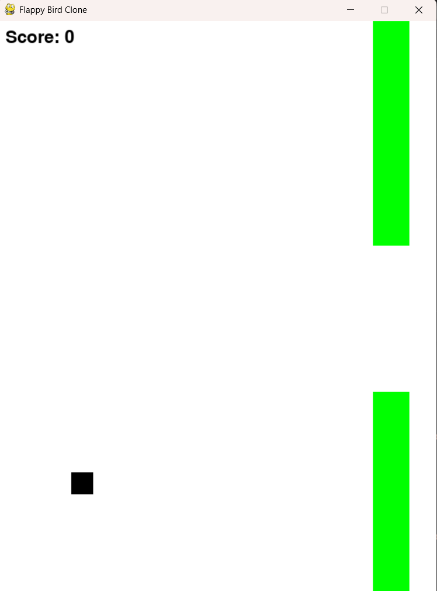

# Flappy Bird Clone

A simple and fun Python implementation of the classic Flappy Bird game. Built using Pygame, this project features a minimalist design with a black bird, green pipes, and a clean white background.

 

---

## Features
- 🖤 Black square bird character
- 🟩 Green pipe obstacles
- ⚪ Clean white background
- 🎯 Collision detection
- 📈 Score tracking
- 🕹️ Easy-to-learn controls (spacebar to jump)

---

## Installation

1. **Clone the repository:**
   ```bash
   git clone https://github.com/your-username/flappy-bird-clone.git
   cd flappy-bird-clone
